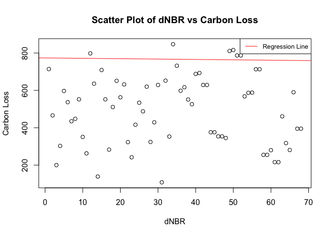

Read me file on Carbon loss modelling from disturbances in Canada using
remotely sensed data
================
Chinyere Ottah
25/September/2023

Table of contents

- Project description
- Software used
- Setup
- Project status

# Description of carbon loss project

The goal of this project is to estimate Carbon loss from disturbance
using remotely sensed data from Canada’s boreal peatlands and forests
(Figure 1). Peatlands (*Sphagnum*) are **wetlands** [^1] containing
partly decomposed plant materials (Wieder, et al., 2008), while forests
are defined as areas with canopy cover \< 10% and tree heights \< 3 m.
Both peatlands and trees serve as significant reservoirs of carbon
stocks in boreal forests, with a substantial portion of this zone
located in Canada. However, these ecosystems are releasing accumulated
biomass from both trees and below ground, primarily due to
climate-induced changes in wildfires. This human-induced climate change
is causing fuels in forests and peatlands to dry out, rendering this
ecosystem more susceptible to wildfires. These fires release carbon
dioxide and other harmful gases into the atmosphere, impacting both
health and plant biomass stocks.

Understanding and accurately predicting the areas vulnerable to burning
is crucial for effective wildfire prevention measures (Parks, 2014).
Additionally, reporting the amount of biomass lost from fires provides
essential feedback for climate-carbon modeling and improvement. In that
case, don’t forget to commit and push the resulting figure files, so
they display on GitHub.

Motivated by these considerations, Chinyere’s research interests
encompass **wildfire**, **biomass**, **carbon**, **peatlands**,
**forests**, and **remote sensing**. I am particularly intrigued by
exploring how remotely sensed data from instruments like Landsat, which
employ optical sensors and active sensors such as lidar, can be employed
to map biomass loss resulting from major disturbances like wildfires.

More about my research can be found here:
[link](https://scholar.google.com/citations?user=pv3jaowAAAAJ&hl=en)


Figure 1: Map of Canada boreal forest

## Geographical extent

Canada’s forested and peatlands ecosystems

## Software used

The software used for this project includes ArcGIS, Google earth engine
and R

## Setup

To run this project, you have to have the latest windows verion. For Mac
users, you have yo.

## Project Status

This project is still ongoing and wit is expected to end by 2026.

# Project assests

The table and scatterplot showing carbon loss and dNBR for fires between
2000 to 2010.

``` r
carbon_loss <- read.csv("/Users/chinyereottah/Desktop/Mac/R_course/Session3_Projects_and_Reproducible_Environments/Carbon_loss_from_disturbances/Response_variable/carbon_loss.csv")
library(knitr)
library(dplyr)
kable(carbon_loss[, c("Carbonloss", "dNBR")], caption = "Carbon Loss Table") %>%
kable_styling(full_width = FALSE) 
```

<table class="table" style="width: auto !important; margin-left: auto; margin-right: auto;">
<caption>
Carbon Loss Table
</caption>
<thead>
<tr>
<th style="text-align:right;">
Carbonloss
</th>
<th style="text-align:right;">
dNBR
</th>
</tr>
</thead>
<tbody>
<tr>
<td style="text-align:right;">
1953.836
</td>
<td style="text-align:right;">
714
</td>
</tr>
<tr>
<td style="text-align:right;">
1019.236
</td>
<td style="text-align:right;">
466
</td>
</tr>
<tr>
<td style="text-align:right;">
1835.740
</td>
<td style="text-align:right;">
200
</td>
</tr>
<tr>
<td style="text-align:right;">
877.229
</td>
<td style="text-align:right;">
303
</td>
</tr>
<tr>
<td style="text-align:right;">
447.045
</td>
<td style="text-align:right;">
597
</td>
</tr>
<tr>
<td style="text-align:right;">
904.129
</td>
<td style="text-align:right;">
537
</td>
</tr>
<tr>
<td style="text-align:right;">
1039.196
</td>
<td style="text-align:right;">
435
</td>
</tr>
<tr>
<td style="text-align:right;">
1033.456
</td>
<td style="text-align:right;">
448
</td>
</tr>
<tr>
<td style="text-align:right;">
858.031
</td>
<td style="text-align:right;">
552
</td>
</tr>
<tr>
<td style="text-align:right;">
430.362
</td>
<td style="text-align:right;">
351
</td>
</tr>
<tr>
<td style="text-align:right;">
250.247
</td>
<td style="text-align:right;">
263
</td>
</tr>
<tr>
<td style="text-align:right;">
632.152
</td>
<td style="text-align:right;">
798
</td>
</tr>
<tr>
<td style="text-align:right;">
1091.289
</td>
<td style="text-align:right;">
636
</td>
</tr>
<tr>
<td style="text-align:right;">
1719.306
</td>
<td style="text-align:right;">
139
</td>
</tr>
<tr>
<td style="text-align:right;">
1582.658
</td>
<td style="text-align:right;">
709
</td>
</tr>
<tr>
<td style="text-align:right;">
917.505
</td>
<td style="text-align:right;">
552
</td>
</tr>
<tr>
<td style="text-align:right;">
548.847
</td>
<td style="text-align:right;">
283
</td>
</tr>
<tr>
<td style="text-align:right;">
740.378
</td>
<td style="text-align:right;">
511
</td>
</tr>
<tr>
<td style="text-align:right;">
481.517
</td>
<td style="text-align:right;">
651
</td>
</tr>
<tr>
<td style="text-align:right;">
1187.024
</td>
<td style="text-align:right;">
563
</td>
</tr>
<tr>
<td style="text-align:right;">
706.971
</td>
<td style="text-align:right;">
632
</td>
</tr>
<tr>
<td style="text-align:right;">
416.707
</td>
<td style="text-align:right;">
323
</td>
</tr>
<tr>
<td style="text-align:right;">
2252.180
</td>
<td style="text-align:right;">
242
</td>
</tr>
<tr>
<td style="text-align:right;">
787.162
</td>
<td style="text-align:right;">
416
</td>
</tr>
<tr>
<td style="text-align:right;">
5460.000
</td>
<td style="text-align:right;">
534
</td>
</tr>
<tr>
<td style="text-align:right;">
508.951
</td>
<td style="text-align:right;">
488
</td>
</tr>
<tr>
<td style="text-align:right;">
1281.476
</td>
<td style="text-align:right;">
620
</td>
</tr>
<tr>
<td style="text-align:right;">
1293.367
</td>
<td style="text-align:right;">
324
</td>
</tr>
<tr>
<td style="text-align:right;">
332.046
</td>
<td style="text-align:right;">
429
</td>
</tr>
<tr>
<td style="text-align:right;">
1038.077
</td>
<td style="text-align:right;">
629
</td>
</tr>
<tr>
<td style="text-align:right;">
714.375
</td>
<td style="text-align:right;">
108
</td>
</tr>
<tr>
<td style="text-align:right;">
147.046
</td>
<td style="text-align:right;">
652
</td>
</tr>
<tr>
<td style="text-align:right;">
249.375
</td>
<td style="text-align:right;">
353
</td>
</tr>
<tr>
<td style="text-align:right;">
556.656
</td>
<td style="text-align:right;">
847
</td>
</tr>
<tr>
<td style="text-align:right;">
794.981
</td>
<td style="text-align:right;">
732
</td>
</tr>
<tr>
<td style="text-align:right;">
99.470
</td>
<td style="text-align:right;">
598
</td>
</tr>
<tr>
<td style="text-align:right;">
89.239
</td>
<td style="text-align:right;">
617
</td>
</tr>
<tr>
<td style="text-align:right;">
260.490
</td>
<td style="text-align:right;">
551
</td>
</tr>
<tr>
<td style="text-align:right;">
1420.485
</td>
<td style="text-align:right;">
526
</td>
</tr>
<tr>
<td style="text-align:right;">
292.508
</td>
<td style="text-align:right;">
688
</td>
</tr>
<tr>
<td style="text-align:right;">
55.269
</td>
<td style="text-align:right;">
693
</td>
</tr>
<tr>
<td style="text-align:right;">
81.880
</td>
<td style="text-align:right;">
629
</td>
</tr>
<tr>
<td style="text-align:right;">
1302.828
</td>
<td style="text-align:right;">
629
</td>
</tr>
<tr>
<td style="text-align:right;">
291.076
</td>
<td style="text-align:right;">
376
</td>
</tr>
<tr>
<td style="text-align:right;">
617.448
</td>
<td style="text-align:right;">
376
</td>
</tr>
<tr>
<td style="text-align:right;">
594.111
</td>
<td style="text-align:right;">
354
</td>
</tr>
<tr>
<td style="text-align:right;">
696.484
</td>
<td style="text-align:right;">
354
</td>
</tr>
<tr>
<td style="text-align:right;">
141.619
</td>
<td style="text-align:right;">
345
</td>
</tr>
<tr>
<td style="text-align:right;">
161.460
</td>
<td style="text-align:right;">
811
</td>
</tr>
<tr>
<td style="text-align:right;">
211.133
</td>
<td style="text-align:right;">
816
</td>
</tr>
<tr>
<td style="text-align:right;">
284.632
</td>
<td style="text-align:right;">
787
</td>
</tr>
<tr>
<td style="text-align:right;">
201.063
</td>
<td style="text-align:right;">
787
</td>
</tr>
<tr>
<td style="text-align:right;">
46.669
</td>
<td style="text-align:right;">
568
</td>
</tr>
<tr>
<td style="text-align:right;">
27.012
</td>
<td style="text-align:right;">
587
</td>
</tr>
<tr>
<td style="text-align:right;">
69.566
</td>
<td style="text-align:right;">
588
</td>
</tr>
<tr>
<td style="text-align:right;">
54.124
</td>
<td style="text-align:right;">
713
</td>
</tr>
<tr>
<td style="text-align:right;">
82.578
</td>
<td style="text-align:right;">
713
</td>
</tr>
<tr>
<td style="text-align:right;">
36.190
</td>
<td style="text-align:right;">
255
</td>
</tr>
<tr>
<td style="text-align:right;">
37.588
</td>
<td style="text-align:right;">
255
</td>
</tr>
<tr>
<td style="text-align:right;">
67.183
</td>
<td style="text-align:right;">
280
</td>
</tr>
<tr>
<td style="text-align:right;">
70.938
</td>
<td style="text-align:right;">
216
</td>
</tr>
<tr>
<td style="text-align:right;">
140.203
</td>
<td style="text-align:right;">
216
</td>
</tr>
<tr>
<td style="text-align:right;">
380.517
</td>
<td style="text-align:right;">
461
</td>
</tr>
<tr>
<td style="text-align:right;">
152.103
</td>
<td style="text-align:right;">
318
</td>
</tr>
<tr>
<td style="text-align:right;">
242.810
</td>
<td style="text-align:right;">
281
</td>
</tr>
<tr>
<td style="text-align:right;">
384.624
</td>
<td style="text-align:right;">
590
</td>
</tr>
<tr>
<td style="text-align:right;">
459.857
</td>
<td style="text-align:right;">
395
</td>
</tr>
<tr>
<td style="text-align:right;">
419.725
</td>
<td style="text-align:right;">
395
</td>
</tr>
</tbody>
</table>

``` r
# Load necessary libraries
library(readr)

# Perform linear regression

model <- lm(Carbonloss ~ dNBR, data = carbon_loss)

# Summarize the regression results

summary(model)
```

    ## 
    ## Call:
    ## lm(formula = Carbonloss ~ dNBR, data = carbon_loss)
    ## 
    ## Residuals:
    ##    Min     1Q Median     3Q    Max 
    ## -684.3 -476.9 -216.8  246.5 4797.7 
    ## 
    ## Coefficients:
    ##             Estimate Std. Error t value Pr(>|t|)   
    ## (Intercept) 773.5874   275.4023   2.809  0.00653 **
    ## dNBR         -0.2083     0.5190  -0.401  0.68944   
    ## ---
    ## Signif. codes:  0 '***' 0.001 '**' 0.01 '*' 0.05 '.' 0.1 ' ' 1
    ## 
    ## Residual standard error: 793.9 on 66 degrees of freedom
    ## Multiple R-squared:  0.002435,   Adjusted R-squared:  -0.01268 
    ## F-statistic: 0.1611 on 1 and 66 DF,  p-value: 0.6894

``` r
# Create a scatter plot

plot(carbon_loss$dNBR, carbon_loss$carbonloss, main = "Scatter Plot of dNBR vs Carbon Loss",
     xlab = "dNBR", ylab = "Carbon Loss")
     
#  regression line

abline(model, col = "red")

# legend

legend("topright", legend = "Regression Line", col = "red", lty = 1, cex = 0.8)
```

<!-- -->

# Project’s Folder Structure

- `R_course/`

  - `Session3_Projects_and_Reproducible_Environments/`

    - `Carbon_loss_from_disturbances/`
      - `Data/`
        - `raw_data.csv` (Sample raw data file)
      - `Response_variable/`
        - `carbon_loss.csv` (The response variable data I am using to
          predict to predict carbon loss)
      - `Scripts/`
        - `preprocess_data.R` (R script for data preprocessing)
      - `Models/`
        - `model1.RDS` (Trained model file)
      - `Results/`
        - `analysis_results.csv` (Sample analysis results)
      - `README.md` (This file, explaining the folder structure)

## Acknowledgement

This project was funded by McMaster University Grdauate Scool. Many
thanks to Prof. Antonio Paez for teaching us and giving us an
intoduction to Github for version control

## Contact

Please feel free to contact me on <ottahc@mcmaster.ca>

[^1]: Marshes, Swamps and peatlands
